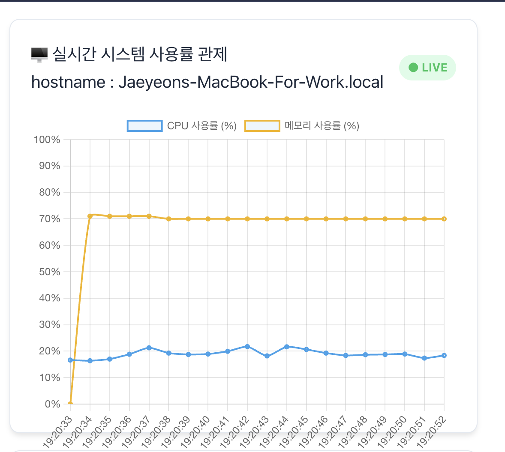

- エージェント
  - 言語
    - Go
  - 役割
    - システムの状態をサーバーに送る
  
- サーバー
  - 言語
    - Java
  - 役割
    - エージェントとボードの仲介
    - Rest API, Socket, WebSocket等

- ボード
  -  言語
     -  TypeScript、React
  -  役割
     -  ユーザーインタフェース
  

- 2026ー07ー07
  - Vue -> Reactに 切り替える